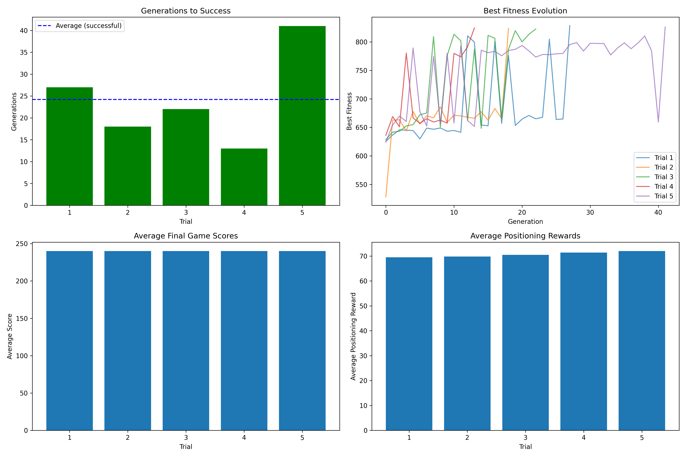
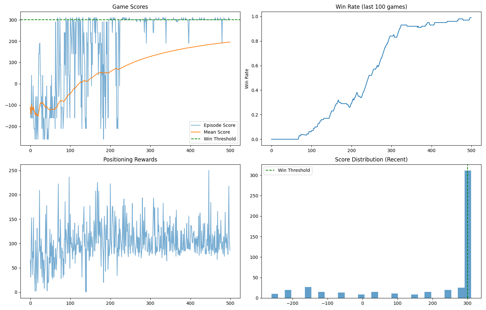

# Shooting Game trained with Reinforcement Learning

This project is a simple catching game implemented in Python with Pygame, enhanced with AI agents trained via a Genetic Algorithm (GA) and a Q-network (reinforcement learning). The goal is to control a player to catch his allies, and maximize the score while avoiding penalties. The project supports both manual and AI play.

## Game 

#### Game rules and rewards

- **Player:** Moves left/right.
- **Targets:** allies (blue) spawn at the top and move down.
- **Rewards:**
  - Colliding with ally: +30
  - Letting ally pass: -20

#### State representation
The game state is represented as a 9-dimensional vector containing:

**1. Player position:**
- `player_x`: Normalized player X position (0.0 to 1.0)

**2. Movement direction:**
- `move_dir`: Last action taken (-1 for LEFT, 1 for RIGHT, 0 for no movement)

**3. Closest ally alignment:**
- `closest_ally_alignment`: Alignment score with nearest ally (0.0 to 1.0)

**4. Information about 3 closest allies:**
For each of the 3 closest allies (sorted by vertical distance):
- `ally_rel_x`: Relative X position (-1.0 to 1.0)
- `ally_rel_y`: Relative Y position (-1.0 to 1.0)

**Representation in code:**
```python
state = [
    player_x,                    
    move_dir,                    
    closest_ally_alignment,      
    ally_1_rel_x, ally_1_rel_y,  
    ally_2_rel_x, ally_2_rel_y,    
    ally_3_rel_x, ally_3_rel_y   
]
```

## Training Results & Analysis

### Genetic Algorithm (PyGAD) Training

I have used this algorithm to find a solution for deterministic kind of game (game seed). The solution was 1000-length chromosome (array) that contained sequence of moves that hopefully would lead to winning the game. 

#### Model Architecture & Parameters
- **Algorithm:** Genetic Algorithm with tournament selection
- **Solution Length:** 1000 actions per sequence
- **Population Size:** 200 individuals
- **Parents Mating:** 100
- **Generations:** 70 maximum per trial
- **Parent Selection:** Tournament selection (K=50)
- **Mutation Rate:** 20% of genes
- **Elite Preservation:** Top 10 individuals
- **Gene Space:** [1, 2] (LEFT, RIGHT actions)
- **Fitness Function:** Positioning reward + 3×Final score + Ally catches
- **Stop Criteria:** success in around 820.0 fitness points

#### Fitness Function Design
The GA uses a multi-component fitness function:
- **Positioning Fitness:** Reward for optimal player positioning
- **Final Score:** Game score multiplied by 3 for emphasis
- **Efficiency Bonus:** Bonus for catching allies (reward > 0.4)
- **Total Fitness = Positioning + (Final Score × 3) + Ally Catches**

#### Training Results
- **Total Trials Conducted:** 5 (just for the stats)
- **Training Environment:** Fixed seed (seed=7) for reproducibility
- **Solution Storage:** Best solutions saved as `.npy` files in `training/pygad_sols/`




### Q-Network (Deep RL) Training

#### Model Architecture
- Model: nn.Linear
- Input Layer: 9 features
- Hidden Layer: 512 neurons with ReLU activation
- Output Layer: 2 actions

#### Training Hyperparameters
```python
MAX_MEMORY = 100_000       
BATCH_SIZE = 1_000         
LEARNING_RATE = 0.005       
EPISODES = 500              
GAMMA = 0.95                

EPSILON_START = 0.8         
EPSILON_MIN = 0.01          
EPSILON_DECAY = 0.995       
```

#### Agent Configuration
- Memory: Deque with 100k capacity
- Model: Linear_QNet(9, 512, 2)
- Optimizer: Adam (lr=0.001)
- Loss Function: MSE Loss
- Training: Short-term + Long-term memory replay

#### Reward System Design
The Q-learning agent uses following reward structure:

**Positioning Rewards:**
- Real-time feedback for optimal positioning
- Continuous reward signal during gameplay

**Win/Loss Rewards:**
```python
def calculate_win_reward(final_score, positioning_reward, steps_taken, max_steps):
    if final_score >= 300:     # win 
        reward += 50.0         # bonus
        efficiency_bonus = max(0, (max_steps - steps_taken) / max_steps * 20)
        reward += efficiency_bonus
    elif final_score <= -500:  # loss 
        reward -= 25.0         # penalty
    else:
        reward += max(0, final_score * 0.1)  # bonus for positive scores
```




## How to Run

#### 1. Install Dependencies

```bash
pip install -r requirements.txt
```

- Requires Python 3.8+.

#### 2. Play the Game Manually

```bash
python main.py
```

- Use arrow keys or A/D to move, SPACE to shoot.
- Game contains addidtional features like opponents and shooting

#### 3. Train with Genetic Algorithm

```bash
python -m training.pygad_train
```

#### 4. Evaluate GA Solutions

```bash
python =m training.pygad_test
```

#### 5. Train Q-Network Agent

```bash
python -m training.rl.agent
```

#### 6. Evaluate Q-Network Agent

```bash
python -m training.rl.eval [model_file]
```
